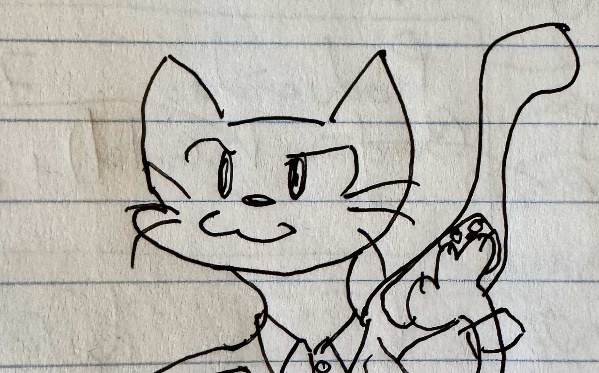
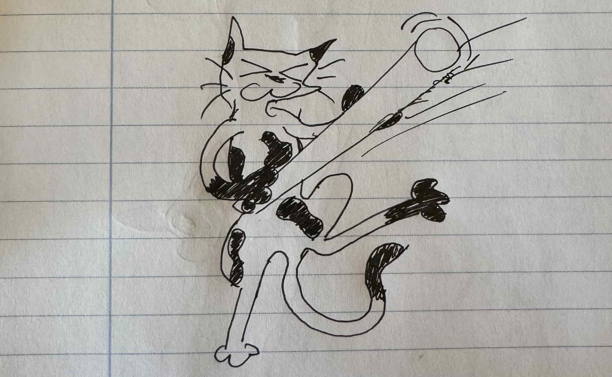

# Personas

## Peluso

Gato naranja.
Alquila una o varias máquinas a terceros, y desconoce cuánto uso le dan
ni qué tipo de uso le dan.

### Perfil

* Conocimiento agrícola.
* Conocimiento en gestión de maquinaria y personal.
* Capacidad de adaptación a los horarios y fechas que impone la realidad.
* Capacidad de dar una respuesta en tiempo record ante los problemas que
  surgen en campaña de recolección.
* Ha realizado una inversión muy importante en maquinaria para cuidar y
  recolectar explotaciones intensivas.

### Necesidades

* Prevenir la mayor cantidad de problemas posible.
* Dar solución a los problemas que se le presente en campaña de recolección
  en cuestión de minutos/horas.
* Conocer su rendimiento de una forma precisa.
* Soluciones efectivas optimizadas en complejidad.

## Rufus

Gato blanco con manchas negras.
Trabaja por cuenta ajena por días (peonadas).

### Perfil

* Sabe recolectar el fruto.
* Dado el entorno, a veces puede ser un poco violento con la maquinaria.

### Necesidades

* Ganar un salario.
